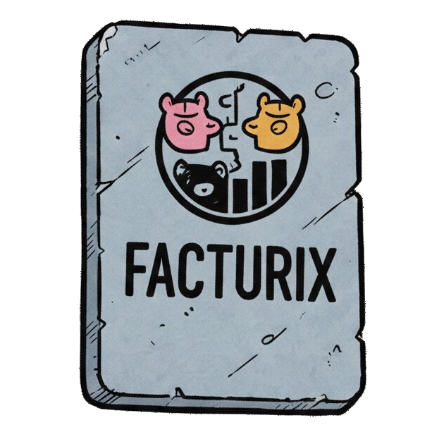
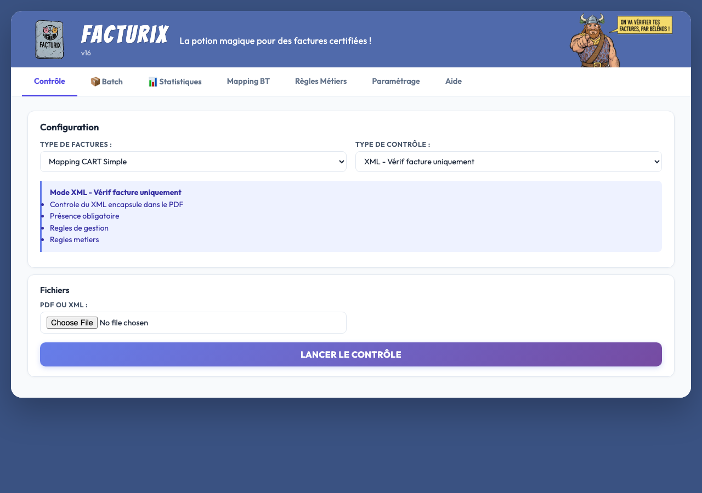
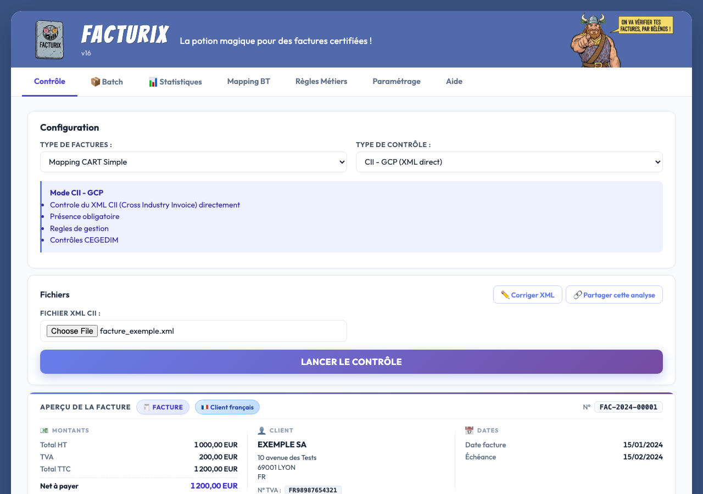
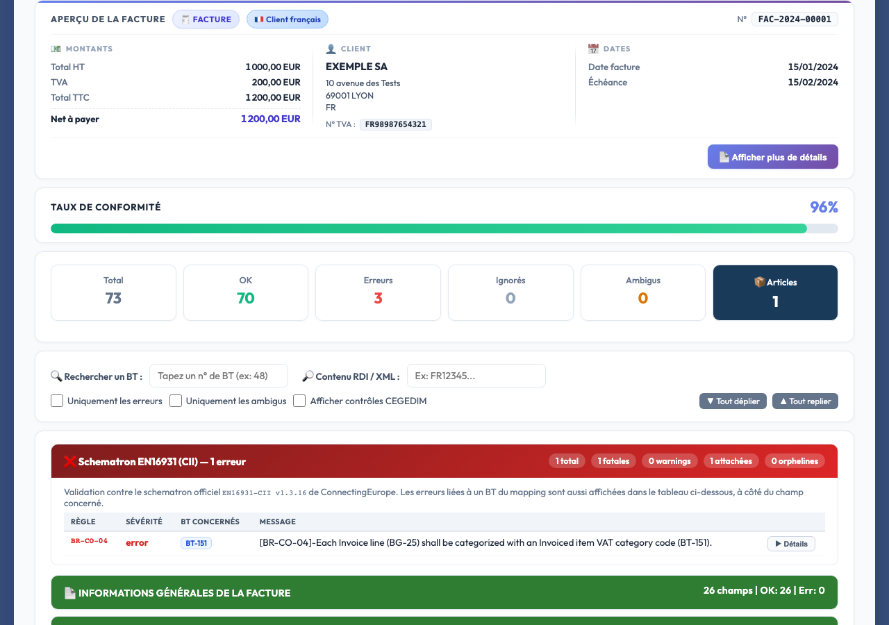
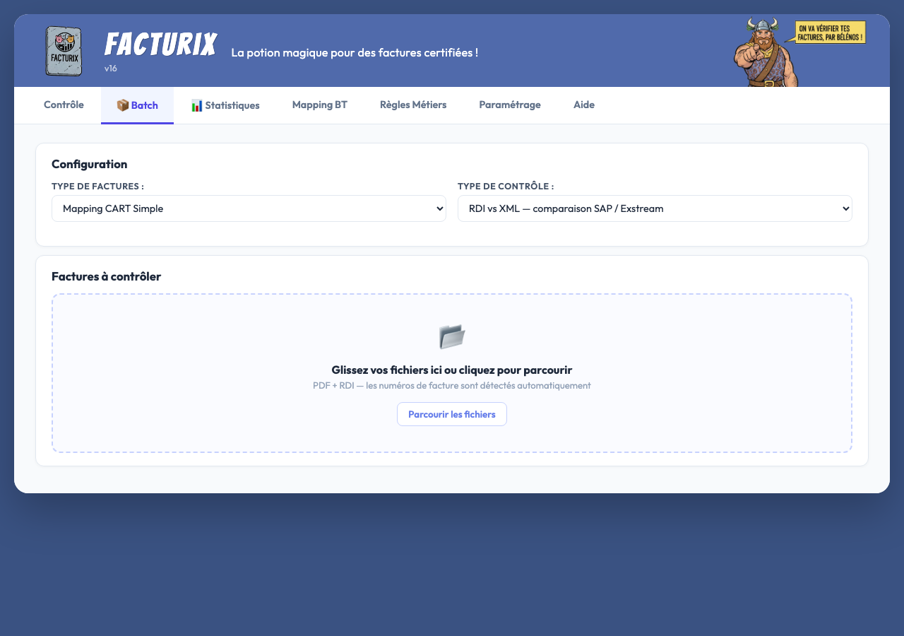

<div align="center">
  

  # Facturix

  **Outil open-source de contrôle des factures électroniques Factur-X / CII**

  *Open-source tool for validating French electronic invoices (Factur-X / EN 16931)*

  [](https://www.python.org)
  [](https://flask.palletsprojects.com)
  [](LICENSE)
  [](https://www.fnfe-mpe.org/factur-x/)
</div>

---

## 🎯 À quoi ça sert ?

Facturix est une application web qui **vérifie la conformité des factures électroniques** au format [Factur-X](https://www.fnfe-mpe.org/factur-x/) / CII (Cross Industry Invoice).

Elle est conçue pour les équipes utilisant **SAP** comme système de facturation : elle compare les données du fichier **RDI** (export SAP, format colonnes fixes cp1252) avec le XML Factur-X embarqué dans le PDF produit par l'outil d'impression (Exstream, etc.), champ par champ, selon la norme EN 16931.

Elle répond à un besoin concret dans le contexte de la **réforme française de la facturation électronique** (obligation progressive à partir de septembre 2026).

### Ce que Facturix contrôle

- La **présence des champs obligatoires** selon la norme EN 16931
- La **cohérence entre le RDI SAP** et le **XML Factur-X** du PDF, champ par champ
- L'application des **règles métier** configurables (B2G Chorus Pro, avoirs, TVA, etc.)
- La **conformité Schematron EN16931** (validation normative officielle)

---

## 📸 Aperçu

**Interface de contrôle** — sélection du mode et dépôt des fichiers :



**Résultats d'analyse** — score de conformité, résumé de la facture, erreurs détectées :



**Détail des résultats** — 96 % de conformité, erreurs Schematron, liste des BT :



**Mapping BT** — édition des champs, XPath, tags RDI SAP :


**Mode Batch** — traitement en lot par glisser-déposer :



---

## ✨ Fonctionnalités

| Fonctionnalité | Description |
|---|---|
| **4 modes de contrôle** | XML seul · RDI SAP seul · CII direct · RDI vs XML |
| **Batch** | Traitement en lot, glisser-déposer, export CSV |
| **Mapping BT configurable** | 100+ champs BT éditables depuis l'interface |
| **Règles métier** | 9 règles par défaut, éditables sans code |
| **Schematron EN16931** | Validation normative v1.3.16 intégrée |
| **Correction XML** | Export d'un XML corrigé depuis les données RDI SAP |
| **Historique & audit** | Traçabilité des contrôles, statistiques, purge |
| **Multi-mappings** | Facture simple, groupée, ventes diverses, custom |

---

## 🚀 Démarrage rapide

```bash
# 1. Cloner le dépôt
git clone https://github.com/votre-org/facturix.git
cd facturix

# 2. Installer les dépendances Python
pip install -r requirements.txt

# 3. Lancer en mode développement
python app.py
```

Ouvrir **http://localhost:5000** dans le navigateur.

> La base SQLite `facturix.db` est créée automatiquement au premier lancement, avec les mappings et règles par défaut.

### Tester avec les exemples fournis

Le répertoire [`exemples/`](exemples/) contient une facture fictive prête à l'emploi :

1. Choisir le mode **CII direct** dans l'onglet Contrôle
2. Déposer `exemples/facture_exemple.xml`
3. Cliquer **Lancer le contrôle**

Pour tester le mode **RDI vs XML** (comparaison SAP ↔ PDF), déposer à la fois `facture_exemple.txt` (RDI SAP) et `facture_exemple.xml`.

---

## 🏗️ Architecture

```
facturix/
├── app.py              # Backend Flask — routes, logique de contrôle (~2900 lignes)
├── parsers.py          # Parsing RDI SAP (cp1252, colonnes fixes) + extraction XML/PDF
├── db.py               # Accès SQLite (mappings, règles, historique)
├── default_rules.py    # Règles métier par défaut (seed BDD)
├── validators/
│   ├── cii_builder.py          # Construction/correction d'un CII depuis le RDI SAP
│   └── schematron_validator.py # Validation EN16931 via Saxon
├── templates/index.html        # Interface web (onglets)
├── static/
│   ├── css/styles.css
│   └── js/app.js
├── schematron/                 # XSLT EN16931-CII v1.3.16
├── exemples/                   # Jeux de données fictifs (RDI SAP + CII XML)
└── facturix.db                 # Base SQLite (générée au premier lancement)
```

**Stack** : Python 3.9+ · Flask · SQLite · lxml · pikepdf · saxonche

### Format RDI SAP

Le fichier RDI est un export texte à colonnes fixes (encodage cp1252) produit par SAP :

```
Position  0-40   : type d'enregistrement (DHEADER / DMAIN) + indicateurs SAP
Position 41-171  : nom du tag SAP (ex. GS_FECT_EINV-BG1-BT22-BAR)
Position 172-174 : longueur de la valeur (3 chiffres)
Position 175+    : valeur du champ
```

---

## ⚙️ Configuration

Toute la configuration se fait **depuis l'interface web**, sans éditer de fichiers :

- **Mapping BT** : ajout/modification/suppression de champs, XPath, tag RDI SAP
- **Règles métier** : conditions et actions configurables
- **Paramétrage** : activation Schematron, seuil d'alerte taille BDD, purge de l'historique

Les données sont stockées dans `facturix.db` (SQLite).

---

## 🐳 Déploiement en production

Voir [DEPLOY.md](DEPLOY.md) pour le guide complet : Gunicorn · nginx · systemd.

---

## 📋 Prérequis

| Dépendance | Rôle |
|---|---|
| Python 3.9+ | Runtime |
| flask | Serveur web |
| lxml | Parsing XML / évaluation XPath |
| pikepdf | Extraction XML depuis PDF |
| PyPDF2 | Lecture métadonnées PDF |
| saxonche | Moteur XSLT pour le Schematron |

---

## 🤝 Contribuer

Les contributions sont bienvenues !

1. Forker le dépôt
2. Créer une branche (`git checkout -b feature/ma-feature`)
3. Commiter les changements (`git commit -m 'feat: description'`)
4. Pousser la branche (`git push origin feature/ma-feature`)
5. Ouvrir une Pull Request

---

## 📜 Licence

Facturix est publié sous **double licence** :

### Licence libre — AGPL v3

Pour les projets open source et l'usage personnel, Facturix est distribué sous [GNU Affero General Public License v3](LICENSE).

Toute application qui utilise ou intègre Facturix doit publier son code source sous AGPL v3. Cela inclut les applications accessibles via un réseau (SaaS, API, etc.).

### Licence commerciale

Si vous souhaitez intégrer Facturix dans un **produit propriétaire** ou un **service commercial** sans les contraintes de l'AGPL, une licence commerciale est disponible.

📩 Contact : [julien.alexandre@rte-france.com](mailto:julien.alexandre@rte-france.com)

---

*Facturix implémente la norme [EN 16931](https://www.fnfe-mpe.org/factur-x/) et le format [Factur-X](https://www.fnfe-mpe.org/factur-x/) développé par le FNFE-MPE.*
